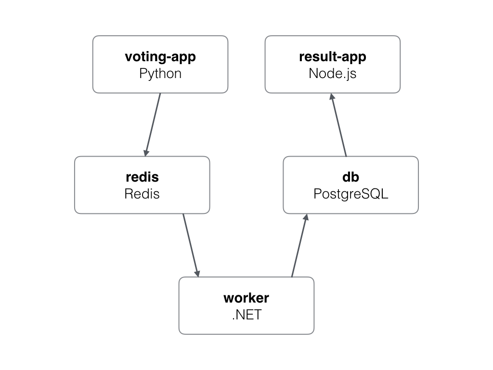

# Assignment: Create A Multi-Service Multi-Node Web App

## Goal: create networks, volumes, and services for a web-based "cats vs. dogs" voting app.
Here is a basic diagram of how the 5 services will work:


- All images are on Docker Hub, so you should use editor to craft your commands locally, then paste them into swarm shell (at least that's how I'd do it)
- a `backend` and `frontend` overlay network are needed. Nothing different about them other then that backend will help protect database from the voting web app. (similar to how a VLAN setup might be in traditional architecture)
- The database server should use a named volume for preserving data. Use the new `--mount` format to do this: `--mount type=volume,source=db-data,target=/var/lib/postgresql/data`

### Services (names below should be service names)
- vote
    - bretfisher/examplevotingapp_vote
    - web front end for users to vote dog/cat
    - ideally published on TCP 80. Container listens on 80
    - on frontend network
    - 2+ replicas of this container

- redis
    - redis:3.2
    - key/value storage for incoming votes
    - no public ports
    - on frontend network
    - 1 replica NOTE VIDEO SAYS TWO BUT ONLY ONE NEEDED

- worker
    - bretfisher/examplevotingapp_worker:java
    - backend processor of redis and storing results in postgres
    - no public ports
    - on frontend and backend networks
    - 1 replica

- db
    - postgres:9.4
    - one named volume needed, pointing to /var/lib/postgresql/data
    - on backend network
    - 1 replica

- result
    - bretfisher/examplevotingapp_result
    - web app that shows results
    - runs on high port since just for admins (lets imagine)
    - so run on a high port of your choosing (I choose 5001), container listens on 80
    - on backend network
    - 1 replica


## My Solution
Each node can only vote once because it is restrained in the node.js backend. Postgres will fail to write vote to db when the same node votes twice.
### Create two networks
We need overlay networks to span across nodes - communication. Two networks are used for protection.
```
# Frontend
docker network create --driver overlay frontend

# Backend
docker network create --driver overlay backend
```
### Start-up containers
```
#### Vote
docker service create --name vote --replicas 2 --network frontend -p 80:80 bretfisher/examplevotingapp_vote

#### Redis
docker service create --name redis --network frontend redis:3.2

#### Worker - need two network tags.
docker service create --name worker --network frontend --network backend bretfisher/examplevotingapp_worker:java

#### db, notice mount tag replaces -v! 
docker service create --name db --network backend -e POSTGRES_PASSWORD=password --mount type=volume,source=db-data,target=/var/lib/postgresql/data postgres:9.4

#### Result
docker service create --name result --network frontend -p 5001:80 --network backend bretfisher/examplevotingapp_result
```
### Test
Everything works. Each node can only vote once. Three nodes, three votes. Postgres password must be "password". Some default password.